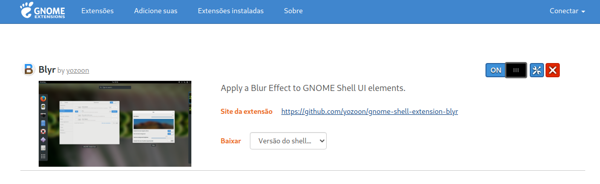

# M a c   T h e m e s   f o r   U b u n t u


# Ubuntu 20.04 LTS

From: https://ubuntuhandbook.org/index.php/2020/08/mac-os-catalina-theme-ubuntu-20-04/

*Special Thanks to [Ji m](https://ubuntuhandbook.org/index.php/about/)*!

## 1. Install gnome-tweaks and other dependencies

```bash
sudo apt update
sudo apt install gnome-tweaks -y
sudo apt install gtk2-engines-murrine gtk2-engines-pixbuf libcanberra-gtk3-module libcanberra-gtk-module libglib2.0-dev gir1.2-gtkclutter-1.0 -y
```


## 2. Download Gnome Mac-OS themes

From https://www.gnome-look.org/p/1241688/#files-panel , extract it and copy to ~/.themes  directory

```bash
cd Downloads
tar -vzxf FILE_NAME.tar.xz -C ~/.themes
```

**OR**

From this directory, copy the default theme to  `~/.themes`

```bash
git clone https://github.com/roger10cassares/mac-themes-for-ubuntu.git
cd mac-themes-for-ubuntu
cp -r Ubuntu_20.04_LTS/,themes/* ~/.themes
```


## 3. Download Gnome Mac-OS icons 

From https://www.gnome-look.org/s/Gnome/p/1309810#files-panel, extract it and  copy to `~/.icons`  directory

```bash
cd Downloads
tar -vzxf FILE_NAME.tar.xz -C ~/.icons
```

**OR**

From this directory, copy the default theme to  `~/.icons

```bash
#Be sure you have git cloned https://github.com/roger10cassares/mac-themes-for-ubuntu.git 
#and gone to the mac-themes-for-ubuntu directory
cp -r Ubuntu_20.04_LTS/,icons/* ~/.icons
```


## 4. Install Gnome Shell Extensions

For the Blur Effect:

```bash
sudo apt install chrome-gnome-shell
```


Go to https://extensions.gnome.org/extension/1036/extensions/ and set it to `ON`


Go to https://extensions.gnome.org/extension/19/user-themes/ and set it to `ON`


Then, go to https://extensions.gnome.org/extension/1251/blyr/ and set it to `ON`




## 5. Apply the Theme and Icons using the Tweaks Interface

Search for Tweaks and click to open


Click in `Appearance` item at the side menu, and choose the  correct `Application`, `Icons` and `Shell` to match the Mac Theme according the following picture. The Background Image can be set over here also.  Choose the Folder Icon and go to `PATH/TO/mac-themes-for-ubuntu/Wallpapers/WorkspaceScreen/10.12_Sierra.jpg` 


## 6. Adjust the Dock Pannel

From the `Terminal` run the following commands

```bash
gsettings set org.gnome.shell.extensions.dash-to-dock dock-position BOTTOM 
gsettings set org.gnome.shell.extensions.dash-to-dock extend-height false
gsettings set org.gnome.shell.extensions.dash-to-dock show-apps-at-top true
gsettings set org.gnome.shell.extensions.dash-to-dock background-opacity 0.3
```


## 7. Workspace Final Result 

With the instructions above, the workspace should look like the following picture:


## 8. Set the Login Screen Background Image

From: https://github.com/PRATAP-KUMAR/focalgdm3

*Special Thanks to [Pratap](https://github.com/PRATAP-KUMAR)!*

Go to `focalgdm3` cloned path from https://github.com/PRATAP-KUMAR/focalgdm3 and run from this directory level:

```bash 
cd focalgdm3
sudo ./focalgdm3 --set
```

Then proceed the following instructions typing `Yes`

```bash
-------------------------------------------------------------------------------------------------------
Please note that after setting login screen background,
>>>>>>>>> Reboot is highly recomonded to see the changes <<<<<<<<<<<<

Do you want to proceed now? [Yes/no] Type n to exit, or press enter to proceed.
-------------------------------------------------------------------------------------------------------
Yes
```

Then, choose type number `1` to set an Image for the `Login Screen` Background

```bash
Please Choose any one number from below.
-------------
1. for Image
2. for Color
-------------
1
```

Finally, type the path for the desired image:

```bash
nter Image Path for Login Screen
----------------------------------------------------
Example1: /usr/share/backgrounds/2.jpg
Example2: /usr/local/share/backgrounds/spaceship.png
Example3: /home/focal/Downloads/myBG.jpeg
----------------------------------------------------
PATH/TO/mac-themes-for-ubuntu/Wallpapers/LoginScreen/oceanRock.jpg
```


## 9. Reboot the PC Linux to apply all the changes and be happy!

```bash
sudo reboot
```


---

*God bless you in The Name of Jesus Christ the Lord*